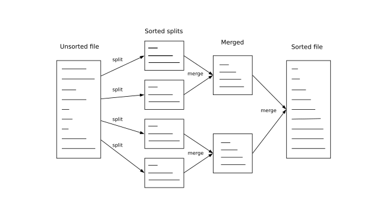

# big-sorter
<a href="https://travis-ci.org/davidmoten/big-sorter"></a><br/>
[](https://maven-badges.herokuapp.com/maven-central/com.github.davidmoten/big-sorter)<br/>
[](https://codecov.io/gh/davidmoten/big-sorter)<br/>

Sorts very large files (or `InputStream`s) by splitting to many intermediate small sorted files and merging.

Status: *deployed to Maven Central*



Note that the merge step in the diagram above will happen repeatedly till one file remains.

## Features

* Easy to use builder
* Single threaded
* Sorts one billion integers from a file to a new file in 444s 
* Serialization helpers for 
  * lines of strings
  * Java IO Serialization
  * DataInputStream base
  * fixed length binary records 
  * CSV
  * JSON arrays
* Serialization is customizable
* Functional style transforms of input data (`filter`, `map`, `flatMap`, `transform`, `transformStream`), includes java.util.Stream support
* Compare sorted files (`findSame`, `findDifferent`, `findComplement`)
* Runtime complexity is O(n log(n))
* 100% test coverage

## Algorithm

One or more large files or `InputStream`s of records are sorted to one output file by:
* splitting the whole files into smaller segments according to `maxItemsPerFile`
* each segment is sorted in memory and then written to a file
* the segment files are then merged in groups according to `maxFilesPerMerge`
* the merged files are repeatedly merged in groups until only one file remains (with all of the sorted entries)
* Note that where possible files are merged with similarly sized files to ensure that we don't start approaching insertion sort computational complexity (O(n<sup>2</sup>).
* the merge step uses a Min Heap (`PriorityQueue`) for efficiency

## Getting started
Add this dependency to your maven pom.xml:
```xml
<dependency>
    <groupId>com.github.davidmoten</groupId>
    <artifactId>big-sorter</artifactId>
    <version>VERSION_HERE</version>
</dependency>
```
If you want to sort csv add this extra dependency:
```xml
<dependency>
    <groupId>org.apache.commons</groupId>
    <artifactId>commons-csv</artifactId>
    <version>1.8</version>
</dependency>
```

If you want to sort JSON arrays add this extra dependency:
```xml
<dependency>
    <groupId>com.fasterxml.jackson.core</groupId>
    <artifactId>jackson-databind</artifactId>
    <version>2.9.9</version>
</dependency>
```
If you are new to Java or Maven, go to [big-sorter-example](https://github.com/davidmoten/big-sorter-example).

## Serialization
To read records from files or InputStreams and to write records to files we need to specify the *serialization* method to use.

### Example for sorting text lines

Make special note of the ability to do functional style transforms of the input data (`filter`, `map`).

```java
File in1 = ...
File in2 = ...
File out = ...
Sorter
  // set both serializer and natural comparator
  .linesUtf8()
  .input(in1, in2)
  .filter(line -> !line.isEmpty())
  .filter(line -> !line.startsWith("#"))
  .map(line -> line.toLowerCase())
  .output(out)
  .maxFilesPerMerge(100) // default is 100
  .maxItemsPerFile(100000) // default is 100,000
  .bufferSize(8192) // default is 8192
  .sort();
```

or for a different character set with "\r\n" line delimiters and in reverse order:

```java
Sorter
  // set both serializer and natural comparator
  .serializerLines(charset, LineDelimiter.CARRIAGE_RETURN_LINE_FEED)
  .comparator(Comparator.reverseOrder())
  .input(in)
  .output(out)
  .sort();
```

### Example for sorting CSV
Note that for sorting CSV you need to add the *commons-csv* dependency (see [Gettting started](#getting-started)).

Given the CSV file below, we will sort on the second column (the "number" column):
```
name,number,cost
WIPER BLADE,35,12.55
ALLEN KEY 5MM,27,3.80
```

```java
Serializer<CSVRecord> serializer = 
  Serializer.csv(
    CSVFormat
      .DEFAULT
      .withFirstRecordAsHeader()
      .withRecordSeparator("\n"),
    StandardCharsets.UTF_8);
Comparator<CSVRecord> comparator = (x, y) -> {
    int a = Integer.parseInt(x.get("number"));
    int b = Integer.parseInt(y.get("number"));
    return Integer.compare(a, b);
};
Sorter 
  .serializer(serializer) 
  .comparator(comparator) 
  .input(inputFile) 
  .output(outputFile)
  .sort();
```
The result is:
```
name,number,cost
ALLEN KEY 5MM,27,3.80
WIPER BLADE,35,12.55
```
### Example for sorting fixed length binary
This example uses a comparator based on byte arrays of length 32. You can also use [`DataSerializer`](#example-using-the-dataserializer-helper) to do more fine grained extraction from the byte arrays (or to handle non-fixed length records).

```java
Serializer<byte[]> serializer = Serializer.fixedSizeRecord(32);
Sorter //
  .serializer(serializer) 
  .comparator((x, y) -> compare(x, y)) 
  .input(new File("input.bin")) 
  .output(new File("sorted.bin")) 
  .sort();
```
You would of course have to implement the `compare(byte[], byte[])` function yourself ( returns -1 if x < y, 1 if x > y, 0 if x == y).

### Example for sorting a JSON array
Note that for sorting JSON you need to add the *jackson-databind* dependency (see [Gettting started](#getting-started)).

Given a JSON array like:

```json
[
{ "name": "fred", "age": 23 },
{ "name": "anne", "age": 31 }
]
```
We can sort the elements by the "name" field like this:

```java
Sorter //
  .serializer(Serializer.jsonArray()) 
  .comparator((x, y) -> x.get("name").asText().compareTo(y.get("name").asText())) 
  .input(new File("input.json")) 
  .output(new File("sorted.json")) 
  .sort();
```

and we get:
```json
[
{ "name": "anne", "age": 31 },
{ "name": "fred", "age": 23 }
]
```
If your structure is more complex than this (for example the array might not be top-level) then copy and customize the class [JsonArraySerializer.java](src/main/java/com/github/davidmoten/bigsorter/JsonArraySerializer.java).

### Example using Java IO Serialization
If each record has been written to the input file using `ObjectOutputStream` then we specify the *java()* Serializer:

```java
Sorter 
  .serializer(Serializer.<Long>java()) 
  .comparator(Comparator.naturalOrder()) 
  .input(in) 
  .output(out) 
  .sort();

```
### Example using the DataSerializer helper
If you would like to serializer/deserialize your objects using `DataOutputStream`/`DataInputStream` then extend the `DataSerializer` class as below. This is a good option for many binary formats. 

Let's use a binary format with a person's name and a height in cm. We'll keep it unrealistically simple with a short field for the length of the persons name, the bytes of the name, and an integer for the height in cm:

```java
public static final class Person {
    final String name;
    final int heightCm;
    ...
}

Serializer<Integer> serializer = new DataSerializer<Integer>() {

    @Override
    public Person read(DataInputStream dis) throws IOException {
        short length;
        // only check for EOF on first item. If it happens after then we have a corrupt file 
        // with incompletely written records
        try {
            length= dis.readShort();
        } catch (EOFException e) {
            return null;
        }
        byte[] bytes = new byte[length];
        dis.readFully(bytes);
        String name = new String(bytes, StandardCharsets.UTF_8);
        int heightCm = dis.readInt();
        return new Person(name, heightCm);
    }

    @Override
    public void write(DataOutputStream dos, Person p) throws IOException {
        dos.writeShort((short) p.name.length());
        dos.write(p.name.getBytes(StandardCharsets.UTF_8));
        dos.writeInt(p.heightCm);
    }

};
      
Sorter 
  .serializer(serializer) 
  .comparator((x, y) -> Integer.compare(x.heightCm, y.heightCm)) 
  .input(in) 
  .output(out) 
  .sort();
``` 
### But my binary file has a header record!

In that case make a type T that can be header or an item and have your serializer return that T object. In your comparator ensure that the header is always sorted to the top and you are done.

### Custom serialization
To fully do your own thing you need to implement the `Serializer` interface.

## Filtering, transforming input
Your large input file might have a lot of irrelevant stuff in it that you want to ignore or you might want to select only the columns from a csv line that you are interested in. You can use the java.util.Stream API to modify the input or use direct methods `filter`, `map`, `flatMap`:

```java
Sorter
  // set both serializer and natural comparator
  .linesUtf8()
  .input(in)
  .filter(line -> !line.isEmpty())
  .filter(line -> !line.startsWith("#"))
  .map(line -> line.toLowerCase())
  .output(out)
  .sort();
```
or

```java
Sorter
  // set both serializer and natural comparator
  .linesUtf8()
  .input(in)
  .transformStream(stream -> 
      stream.filter(line -> !line.isEmpty())
            .filter(line -> !line.startsWith("#"))
            .map(line -> line.toLowerCase()))
  .output(out)
  .sort();
```  
## How to read the output file
Having sorted to a file `f`, you can read from that file like so (`Reader` is `Iterable`):

```java
Reader<T> reader = serializer.createReader(f);
for (T t: reader) {
    System.out.println(t);
}
```
An example with String lines:

```java
Reader<String> reader = Serializer.linesUtf8().createReader(f);
reader.forEach(System.out::println);
```

If you want to stream records from a file do this:

```java
// ensure reader is closed after handling stream
try (Reader<T> reader = serializer.createReader(output)) {
    Stream<T> stream = reader.stream();
    ...
}
```

## Returning the result as a Stream<T>

You might want to deal with the results of the sort immediately and be prepared to throw away the output file once read by a stream:

```java
try (Stream<String> stream = Sorter
  .linesUtf8()
  .input(in)
  .outputAsStream()
  .sort()) {
    stream.forEach(System.out::println);
}
``` 
The interaction is a little bit clumsy because you need the stream to be auto-closed by the try-catch-with-resources block.
Note especially that a terminal operation (like `.collect(...)` or `count()`) does **not** close the stream. When called,  
the close action of the stream deletes the file used as output. If you don't close the stream then you will accumulate final output files in the temp directory and possibly run out of disk.

The fact that java.util.Stream has poor support for closing resources tempts the author to switch to a more appropriate functional library like [kool](https://github.com/davidmoten/kool). We'll see.

See [here](#how-to-read-the-output-file) to stream records from a file.

## Comparing sorted files
Once you've got multiple sorted files you may want to perform some comparisons. Common comparisons include:

* find common records (use `Util.findSame`)
* find different records (use `Util.findDifferent`)
* find records that are not present in the other file (use `Util.findComplement`)

Here's an example of using `Util.findSame` (`findDifferent` and `findComplement` use the same approach):

```java
// already sorted
File a = ...
// already sorted
File b = ...
// result of the operation
File out = ...
Util.findSame(a, b, Serializer.linesUtf8(), Comparator.naturalOrder(), out);
```

## Logging
If you want some insight into the progress of the sort then set a logger in the builder:

```java
Sorter
  .linesUtf8()
  .input(in)
  .output(out)
  .logger(x -> log.info(x))
  .sort();
```
You can use the `.loggerStdOut()` method in the builder and you will get timestamped output written to the console:

```
2019-05-25 09:12:59.4+1000 starting sort
2019-05-25 09:13:03.2+1000 total=100000, sorted 100000 records to file big-sorter2118475291065234969 in 1.787s
2019-05-25 09:13:05.9+1000 total=200000, sorted 100000 records to file big-sorter2566930097970845433 in 2.240s
2019-05-25 09:13:08.9+1000 total=300000, sorted 100000 records to file big-sorter6018566301838556627 in 2.243s
2019-05-25 09:13:11.9+1000 total=400000, sorted 100000 records to file big-sorter4803313760593338955 in 0.975s
2019-05-25 09:13:14.3+1000 total=500000, sorted 100000 records to file big-sorter9199236260699264566 in 0.962s
2019-05-25 09:13:16.7+1000 total=600000, sorted 100000 records to file big-sorter2064358954108583653 in 0.989s
2019-05-25 09:13:19.1+1000 total=700000, sorted 100000 records to file big-sorter6934618230625335397 in 0.964s
2019-05-25 09:13:21.5+1000 total=800000, sorted 100000 records to file big-sorter5759615033643361667 in 0.975s
2019-05-25 09:13:24.1+1000 total=900000, sorted 100000 records to file big-sorter6808081723248409045 in 0.948s
2019-05-25 09:13:25.8+1000 total=1000000, sorted 100000 records to file big-sorter2456434677554311136 in 0.983s
2019-05-25 09:13:25.8+1000 completed inital split and sort, starting merge
2019-05-25 09:13:25.8+1000 merging 10 files
2019-05-25 09:13:36.8+1000 sort of 1000000 records completed in 37.456s
```

## Memory usage
Memory usage is directly linked to the value of the `maxItemsPerFile` parameter which you can set in the builder. Its default is 100000. If too much memory is being used reduce that number and test.


## Benchmarks

```
10^3 integers sorted in 0.004s
10^4 integers sorted in 0.013s
10^5 integers sorted in 0.064s
10^6 integers sorted in 0.605s
10^7 integers sorted in 3.166s
10^8 integers sorted in 35.978s
10^9 integers sorted in 444.549s
```
